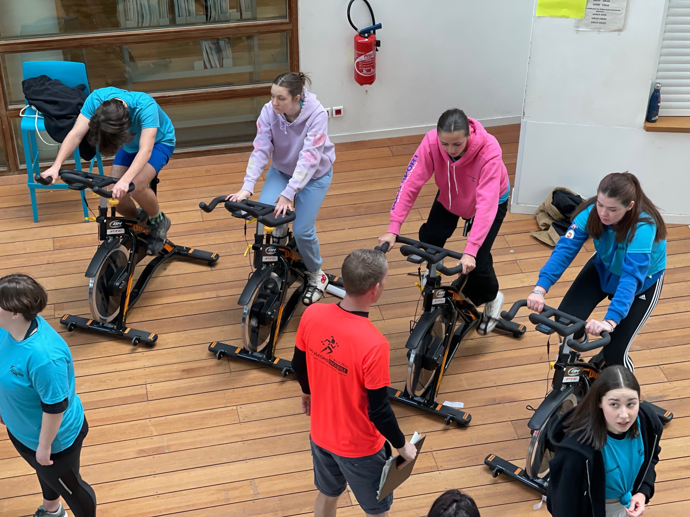

# Compteur d'énergie sur vélo d'appartement

## Mise en situation

Pour la journée "Bougeons Ensemble #2" qui se tiendra le 23 mai prochain, 

{ .center width=50%}

On nous demande de mettre au point un dispositif permettant de :

- mesurer l'activité physique réalisée sur chacun des vélos d'appartement de cet atelier ;
- collecter les informations mesurées sur chacun des quatres appareils ;
- calculer et afficher les énergies correspondantes aux exercices physiques successifs réalisés dans l'atelier:
    - énergie musculaire en Joules et en Calories, énergie électrique correspondante produite par un alternateur rechargeant la batterie d'un smartphone en Watt heure et en Ampères heure, temps d'usage d'un smartphone "S" pour un jeu "J"... 
    - cumul des énergies par vélo, pour chaque relayeur, par équipe sur l'atelier, et globalement sur la journée.

## Tâches à réaliser

- Observer le mécanisme du vélo d'appartement et produire un schéma cinématique et une modélisation 3D simplifiée ;
- Caractériser et mesurer le signal d'information issue du capteur témoin de l'activité physique réalisée ;
- Expérimenter la connexion de ce capteur à une carte BBC micro:bit et collecter ainsi l'information qui en est issue ;
- Développer une solution fiable pour la connectique et la fixation d'une carte BBC micro:bit sur un des vélo ;
- Développer un programme capable de collecter et de traiter les informations images de l'activité physique réalisée sur chaque appareil de l'atelier...